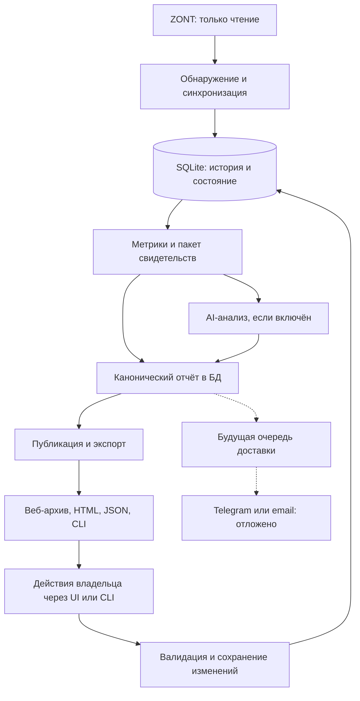

# Архитектура и действующие инварианты

Обновлено: 2026-09-07. Действующая архитектура и карта компонентов для разработки.
Порядок работ — в [плане](./implementation_plan.md), ожидания — в [ТЗ](./product-scenarios.md).
Точные схемы и функции проверять в соответствующем коде, не по старым проектным эскизам.

## Цель и основания решений

Приложение заменяет ручной разбор графиков непрерывным наблюдением за отоплением
и ГВС: объясняет происходящее, замечает скрытые проблемы, предлагает уместные ручные
эксперименты и проверяет их пользу при сохранении комфорта. Оно не дублирует
аварийную сигнализацию ZONT и не обязано находить повод менять настройки каждый день.
Полное действующее описание цели — [продуктовые требования](./product-scenarios.md).

Отсюда разделение ответственности: исходная история и проверяемая математика
остаются локально; AI связывает свидетельства и рассматривает объяснения;
владелец принимает решения, а каналы доставки лишь предоставляют результат.

## Данные и границы

ZONT → read-only адаптер → нормализация и SQLite → детерминированные метрики и
пакет свидетельств → AI-интерпретация → сохранённые отчёты → HTML/JSON и веб-интерфейс.
CLI и автономный worker используют общий прикладной слой. Просмотр готового отчёта
не запускает анализ. Публикация сохранённых отчётов не требует нового AI-вызова.

Приложение не меняет ZONT; AI не получает инструменты управления. Рекомендация —
ручной эксперимент с одной переменной, прогнозом, окном наблюдения и проверкой результата.
Текущая установка не задаёт defaults для всех домов: возможности обнаруживаются,
недостающий контекст задаётся явно, неизвестные данные не угадываются.

SQLite хранит исходную историю, результаты, пользовательские данные и кэши.
Миграции должны сохранять данные; живую БД копируют через online backup.
Текущие настройки нельзя переносить в прошлое. Версии алгоритмов/контекстов
определяют пригодность кэша; изменение представления не повод повторять весь анализ.

## Потоки данных

Пунктир показывает ещё не реализованные каналы. Пользовательская запись может
обновить представление отчёта; новый расчёт выполняется отдельным прикладным
сценарием. Ни один из потоков не ведёт к изменению настроек ZONT.

## Аналитика

- Детерминированный код отвечает за источники, качество, временные границы,
  арифметику и ограниченные окна свидетельств. AI — за многофакторные объяснения,
  конкурирующие гипотезы, прогнозы и рекомендации; не заменять его россыпью порогов.
- Пропуски и неизвестность сохраняются. Уставки и команды — состояния до следующего
  изменения или явного unknown; правила cadence/устаревания датчиков к ним неприменимы.
- Отопление, ГВС, неоднозначное назначение и пропуски различаются; один эпизод
  нельзя одновременно выдавать за подтверждённую работу двух независимых контуров.
- Сравнения периодов учитывают погоду, режим, комфорт, ГВС и покрытие. Недостаток
  истории означает отсутствие надёжного сравнения, а не нулевой эффект.
- Измеренный общий газ отделён от модельного расхода котла и распределения по
  назначению. Модуляция 0% при активной горелке не означает выключение.
  Неизвестный расход не распределяется принудительно; оценка сохраняет надёжность.
- Показания и профиль оборудования — пользовательские данные с историей/аудитом;
  пересчёт и публикация не должны их изменять. AI-поля не заменяются при рендере.

### Достоверность и семантика показателей

Сохранять уровни `observed → derived → inferred → predicted`: измерение,
вычисленная величина, гипотеза и прогноз различаются в данных и представлении.
Производная метрика имеет происхождение, гипотеза — свидетельства за и против,
прогноз не выдаётся за наблюдение. Точные DTO определяет `domain/`, не старый
пример JSON. Это ограничение распространяется и на стоимость газа.

Метрики усредняются по наблюдаемому времени, не по количеству точек. У процентов
и частот должен быть явный знаменатель: час наблюдения отличается от часа горения.
Длительность циклов, старты, паузы и модуляция не сводятся в один «коэффициент
тактования»; универсальный порог не выдаётся за норму любого котла.

Качество оценивается по подсистемам и нужным свидетельствам: хороший комнатный
ряд не компенсирует пропуски БКН. Запрос контура, пламя и фактическая работа —
разные сигналы. Режим владельца, автоматическое летнее состояние и сезон также
не взаимозаменяемы. ГВС считается причиной задержки отопления только при
подтверждённом запросе отопления. Без данных насоса, клапана или расхода наблюдаемая
последовательность не доказывает гидравлическую причину.

### Назначение разных периодов

Первичный анализ выявляет качество истории, возможности и существенные проблемы
дома. Дневной объясняет события завершённых суток и следующий шаг наблюдения.
Недельный/месячный/сезонный обзоры самостоятельно сопоставляют периоды и оценивают
результат изменений, а не просто склеивают дневные тексты.
Отсутствие прошлой истории или сопоставимых условий явно ограничивает вывод.
Список гипотетических квартальных/годовых команд из исходного проекта не является
обязательством добавить новые типы отчётов: они нужны только по отдельной потребности.

## Отчёты и изменения владельца

Доступны дневные, недельные, месячные и сезонные отчёты. Переход между типами
открывает последний доступный отчёт этого типа; календарь — по явному действию.
HTML и API защищены общим периметром доступа. Записи feedback сериализованы;
сохранение комментария публикует один отчёт, но может ждать общую блокировку.
Возможное развитие описано в [backlog публикации](./publication-backlog.md).

Отсутствие ответа на рекомендацию не означает её отклонение или выполнение.
Состояние `ignored` отделено от явных исходов `applied/rejected`; периодическое
обслуживание идемпотентно. Отклонённый совет не повторяется без новых оснований.

HTML должен оставаться переносимым, без обязательного внешнего CDN; текст
владельца и модели экранируется. Общий периметр защищает и страницы, и manifest,
и API; наличие токена с правом записи не должно создавать путь к write API ZONT.

## Компоненты и ответственность

Это карта существующего кода, а не предлагаемая структура будущего проекта.

| Слой | Ответственность и точка входа |
| --- | --- |
| CLI и runtime | Команды, конфигурация, создание сервисов: [cli.py](../src/zont_analyzer/cli.py), [runtime.py](../src/zont_analyzer/runtime.py) |
| Адаптер ZONT | Только чтение, декодирование ответа, профиль оборудования: [zont_readonly/](../src/zont_analyzer/adapters/zont_readonly/) |
| Прикладные сценарии | Загрузка, анализ, сравнения, изменения владельца и публикация: [application/](../src/zont_analyzer/application/) |
| Предметные контракты | Модели отчёта, рассуждений, периодов и экспериментов: [domain/](../src/zont_analyzer/domain/) |
| Расчёты | Качество, свидетельства, отопление/ГВС, газ, надёжность: [analytics/](../src/zont_analyzer/analytics/) |
| SQLite | ORM, транзакции, чтение/запись и backup: [database.py](../src/zont_analyzer/adapters/sqlite/database.py); изменения схемы — [миграции](../migrations/versions/) |
| AI | Вызов провайдера и проверка ответа: [provider.py](../src/zont_analyzer/adapters/openai/provider.py); учёт обращений — [ai_ledger.py](../src/zont_analyzer/application/ai_ledger.py) |
| Представление | HTML, графики и формы: [reports/](../src/zont_analyzer/reports/); публикация — [publication.py](../src/zont_analyzer/application/publication.py) |

Стек фиксирует [pyproject.toml](../pyproject.toml): Python, Typer, Pydantic,
HTTPX, SQLAlchemy/Alembic, Jinja2 и SDK OpenAI. Эксплуатационное окружение — Docker.
Архитектура не требует смены СУБД, очереди или новых сервисов без подтверждённой потребности.

## Хранение и происхождение данных

SQLite — основное хранилище для текущей установки. WAL, foreign keys, busy timeout
и UPSERT поддерживают совместное чтение и сериализованную запись. Это не обещание
неограниченной производительности: рост истории, время запросов, размер backup
и восстановление проверяются локально по реальной эксплуатационной потребности.
Старая оценка объёма на несколько лет не является результатом такого теста.

Выбор SQLite обусловлен связанными данными, транзакциями и небольшой стоимостью
эксплуатации одного дома. Отдельная СУБД добавляет сопровождение и не становится
нужной только из-за временных рядов. Если измерения покажут предел хранилища,
сначала рассмотреть вынос телеметрии за границу адаптера, сохраняя предметные
контракты; конкретную замену выбирать по нагрузке. Не обещать, что текущий код
уже позволяет заменить БД без доработок.

Основные группы сохраняемых данных:

- устройства, сущности, снимки конфигурации и справочник временных рядов;
- канонические измерения, события источника, курсоры синхронизации и разрывы;
- периоды анализа, метрики, события, канонические отчёты и кэши;
- рекомендации, отметки владельца и ручные эксперименты;
- профиль владельца, показания газа и связанные данные калибровки;
- месячные тарифы газа и аудит исправлений цены/валюты;
- состояние задач и журнал обращений к AI.

Точную схему определяют ORM и миграции; список выше не задаёт новые таблицы.
Исходная временная гранулярность нужна для проверки происхождения и повторных
расчётов. Агрегаты не заменяют исходные измерения. Очистка или снижение детализации
истории не должны появляться как побочный эффект публикации либо миграции.

Физические датчики хранятся отдельно по стабильной идентичности. Логическая роль
контрольной температуры не превращает несколько датчиков в анонимный ряд:
смена источника должна оставаться различимой, иначе она выглядит как скачок температуры.
Снимок текущей конфигурации не доказывает, какие настройки действовали раньше.
Каноническую историю пока сохраняем без автоматического сокращения. Сроки хранения
отладочных ответов, пороги диска и переход к агрегатам требуют отдельной политики
и проверенного backup; прежние «30 дней» и «25% диска» были предложением, не контрактом.
Открытые вопросы масштаба и хранения остаются в [дорожной карте](./roadmap.md).

## Синхронизация и автономная работа

[IngestionService](../src/zont_analyzer/application/ingestion.py) отделяет первичную
загрузку истории от обычного инкрементального опроса. Курсоры первичного импорта
не подменяются курсором свежих данных. Регулярная синхронизация использует перекрытие
окон для поздних измерений; повторная загрузка сохраняет канонические ключи точек.
Неуспешное окно не должно объявляться успешно завершённой загрузкой истории.

Автономный цикл использует те же сервисы, что CLI: синхронизация, догоняющий расчёт
пропущенных завершённых дней, периодические отчёты и публикация. Границы дня,
недели, месяца и сезона определяются в часовом поясе объекта; неполный сезон
не выдаётся за завершённый. Расписание и сравнения длинных периодов вынесены
в отдельные модули `application/period_*` и `application/long_periods.py`.

Сохранённый канонический отчёт и его HTML-представление — разные уровни.
Публикация переиспользует сохранённые расчёты и пригодные кэши; атомарная замена
файлов защищает читателя от частично записанного HTML. Запись комментария должна
сначала сохранять пользовательские данные; задержка обновления представления
не означает, что комментарий надо повторно отправлять.

Атомарна замена отдельного файла, а не всего архива сразу. Manifest публикуется
после файлов отчётов, latest — после архива; сбой может оставить смесь готовых
старых и новых файлов, но не ссылку на недописанный отчёт. Блокировки публикации
не следует путать с транзакциями SQLite или общей очередью внешних уведомлений.
Временные точки нормализуются в UTC, календарные границы — в зоне объекта;
переходы времени и невосстановимые пропуски должны оставаться различимыми.

Актуальность дневного расчёта определяется содержимым телеметрии строго внутри
`[period_start, period_end)`, а не изменением целых суток UTC. Маркеры суток UTC
служат только для инвалидирования кэша точной ревизии. Повторная загрузка одинаковых
показаний и изменения за границами периода не требуют повторного анализа.
При переходе со старых ревизий совпадающие маркеры позволяют обновить только
служебную отметку сохранённого отчёта, без пересчёта и нового запроса к AI.

У нового успешного AI-ответа сохраняется отпечаток фактов отчёта. При автоматическом
пересчёте сравниваются факты с этим исходным отпечатком; служебные ревизии, время
создания отчёта и признаки переиспользования AI не считаются изменением фактов.
Неизменные факты не делают AI устаревшим. Повторные пересчёты сохраняют исходный
отпечаток и время AI, а не принимают предыдущий пересчёт за новую исходную точку.
Для старых уже перезаписанных ответов без исходного отпечатка нельзя доказать
совпадение: интерфейс сообщает о недоступности сравнения, не утверждая изменение.

## Контракт рассуждений и ручных экспериментов

AI получает ограниченный пакет свидетельств: метрики, динамику выбранных эпизодов,
профиль оборудования, качество данных, прошлые гипотезы и действия владельца.
Ответ проверяется строгой схемой провайдера и предметной валидацией; свободный
текст не становится исполняемой командой или достоверным измерением.

Рекомендации связываются с исходными свидетельствами. Эксперимент фиксирует ручное
изменение, исходное состояние, ожидаемый эффект, срок наблюдения и условия возврата.
Оценка до/после учитывает сопоставимость; отсутствие данных не превращается в успех.
Не советовать отключение защит, вмешательство в газовую арматуру, горение,
сервисные калибровки или электропроводку. Допустимые диапазоны производителя
нельзя выдумывать; при недостатке контекста численная точность совета ограничивается.

Версии контекста, модели и обращения, результаты и расход токенов нужны для
воспроизводимости и контроля бюджета. Повторная публикация не создаёт новый
AI-анализ. Сбор и локальная аналитика продолжаются при отключённом AI;
конкретные модели и лимиты определяет конфигурация, не исторический список моделей.

Память аналитика — сохранённые структурированные факты и исходы в SQLite,
не бесконечно растущий диалог. Кэш различает входной пакет, модель и параметры,
версии prompt/schema; экономия вызовов не должна подменять свежий анализ старым.
Отказ AI или исчерпание бюджета не означает отсутствие проблем в отоплении:
показывать локальный результат и состояние AI отдельно. Надёжную очередь
отложенного AI-анализа не считать уже реализованной только по старому эскизу.

## Выбор моделей анализа

Выбор модели — часть архитектурной политики, а не только строка конфигурации.
Частый дневной анализ должен иметь приемлемые стоимость и задержку; длинный обзор
может требовать более сильного рассуждения для связи нескольких периодов и факторов.
Менять модель следует по сравнительным проверкам на одних и тех же сохранённых
пакетах: корректность фактов, уместность гипотез, работа с неизвестностью,
качество экспериментов, соблюдение схемы, токены и время ответа.

Текущие **значения по умолчанию в репозитории**, сверенные 2026-09-07:

| Назначение | Поле конфигурации | Значение |
| --- | --- | --- |
| Дневной анализ (`daily`) | `openai.daily_model` | `gpt-5.6-luna` |
| Все остальные виды анализа, включая первичный и длинные обзоры | `openai.review_model` | `gpt-5.6-terra` |
| Общая глубина рассуждения | `openai.reasoning_effort` | `medium` |

Источники: [OpenAIConfig](../src/zont_analyzer/config.py) и
[выбор профиля в провайдере](../src/zont_analyzer/adapters/openai/provider.py).
Это описание кода, не проверка доступности моделей у провайдера и не утверждение
о фактической конфигурации HK. Настройки могут переопределяться; при изменении
defaults или маршрутизации обновлять эту таблицу и [пример](../config.example.yaml).

Прежняя идея отдельной сильной модели для ручного разбора спорных случаев
остаётся отложенной: отдельного третьего маршрута сейчас нет. Вводить его только
если оценка покажет полезное улучшение относительно профиля обзоров.
Сильнейшая доступная модель не назначается всем задачам автоматически.
AI выключаем конфигурацией или `--no-ai`; его отсутствие не останавливает сбор.

Регулярный пересмотр по официальным источникам, выбор в веб-настройках и подпись
фактической модели сохранённого анализа — самостоятельная [доработка 9.2](./model-maintenance-plan.md).
Она рекомендует изменение пользователю, но не переключает модель автоматически.

## Конфигурация и секреты

[config.py](../src/zont_analyzer/config.py) загружает типизированные настройки:
явный `--config`, иначе `ZONT_ANALYZER_CONFIG`, затем `config.yaml` рабочего
каталога или каталога данных. Обнаруженный профиль оборудования и явные уточнения
владельца имеют происхождение; неизвестные возможности не становятся defaults дома.
Шаблон — [config.example.yaml](../config.example.yaml).

Секреты передаются через окружение или закрытые файлы; диагностика показывает
наличие, а не значения. Пользовательская конфигурация не перезаписывается при
обнаружении оборудования или выпуске. `AGENTS.md` регулирует разработку;
он не является системным промптом работающего отопительного аналитика.

Автообнаружение не должно угадывать приоритет комфорта и экономии. До явного
уточнения сохранять существующий комфорт; задавать вопрос только если ответ
меняет вывод. Пользовательские настройки не ослабляют встроенные запреты
управления, проверки происхождения и валидацию ответа AI.

## Каналы и дальнейшие интеграции

HTML/JSON и веб-архив — действующие представления канонического отчёта.
Telegram — сохранённое отложенное направление исходящих уведомлений;
email — рассматриваемый вариант доставки. Их состояние, назначение и будущие
контракты описаны в [плане каналов](./delivery-plan.md). Ошибка внешней доставки
не должна блокировать сбор и анализ; повторная отправка не порождает новый AI-отчёт.

## Стоимость газа и отложенное расширение

[Контракт 9.1](./gas-cost-plan.md) добавляет историю месячной цены/валюты и денежный
слой поверх существующих объёмов. Цена меняется рядом с показанием счётчика.
Обычное изменение применяется со следующего календарного месяца в часовом поясе
объекта; последнее сохранение планового месяца побеждает с сохранением аудита.
Decimal-расчёт использует прежнюю временную модель расхода только для разделения
месячных тарифов, не меняет исходные объёмы и надёжность. Отсутствующий тариф не
означает нулевую цену, валюты сохраняются раздельно. Публикация после изменения
тарифа обновляет денежные поля затронутых отчётов и сравнений без AI-запросов.
Метрика пользы
приложения остаётся отдельным отложенным исследованием, не свойством текущей аналитики.

## Эксплуатация и проверки

Секреты не входят в репозиторий и отчёты. Python-сборки, тесты и подготовка данных —
только [локально в Docker](./container-development.md), исходники read-only.
HK получает готовый проверенный immutable image и только короткий smoke;
полные тесты и тяжёлый анализ на сервере запрещены. Детали — в
[процедуре приёмки](./release-process.md) и [инструкции эксплуатации](../deploy/OPERATIONS.md).

## Как проверять архитектурные свойства

Регрессии проверять по контрактам: временное взвешивание, UTC/локальные границы,
UPSERT и поздние точки, отдельное качество подсистем, перезапуск и повтор операций,
миграции/backup/восстановление, сохранность исходной истории и данных владельца.
Контрактные фикстуры ZONT обезличены; проверяются read-only граница и отсутствие
секретов в диагностике. HTML проверяется на экранирование, сохранение показателей
и читаемость; тестируется сбой публикации, а не только успешный рендер.

Модель, prompt и schema проходят общий набор оценочных пакетов: достоверные ссылки
на свидетельства, неизвестность, уместность действий, отсутствие повторения
отклонённого совета без оснований, стоимость и задержка. Моки проверяют интеграцию,
но не доказывают качество новой модели. Проверки производительности и длительной
эксплуатации нельзя объявлять пройденными на основании короткого smoke.

Продуктовый успех — сохранная история, полезные объяснения, измеримый результат
ручных изменений и приемлемые расходы/время анализа. Число дней работы или зелёные
тесты сами по себе не доказывают пользу владельцу.

## Границы усложнения

Собственное обучение модели, векторная БД, многоагентная среда анализа, отдельный
сложный SPA и Telegram Mini App не нужны без конкретной доказанной задачи.
Внешняя погода может стать отдельным источником с происхождением и покрытием,
но не должна незаметно заменять измерения датчика. Возможные расширения сохраняются
в backlog, а старые схемы таблиц, команды и численные пороги — в архиве.
